<div align="center">

# Diksha Damahe — Portfolio Vol. 1

**A portfolio you read like a sketchbook.** A hand-drawn notebook that opens on click, turns its pages in 3D, and keeps every project, paper and certificate on a spread of grid paper.

[](https://github.com/dikshadamahe/dikshadamahe.github.io/actions/workflows/deploy.yml)
[](https://nextjs.org)
[](https://react.dev)
[](https://www.typescriptlang.org)
[](https://gsap.com)

### [→ Open the notebook](https://dikshadamahe.github.io/)

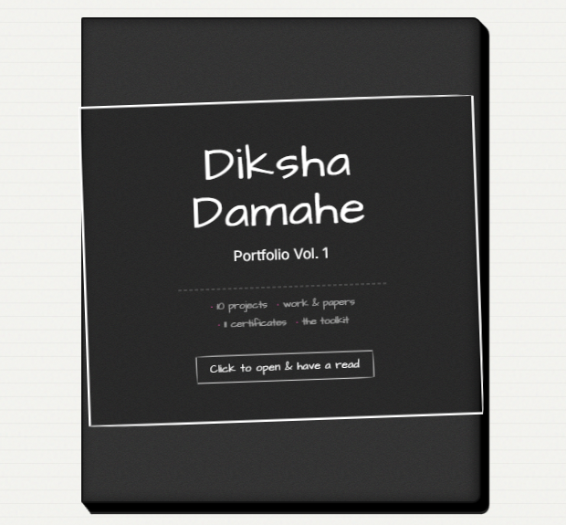

</div>

---

## What this is

Most portfolios are a scrolling page. This one is a physical object: a black board cover you click to open, two facing pages of grid paper with a red margin rule, coloured tabs down the right edge, and sheets that actually swing around the spine when you change section.

Everything is real data — ten projects, an IEEE paper, eleven certificates — and every card links out to the code, the deployment, or the credential.

---

## The spreads

### Home — who I am, facing what I work with

The inside of the front cover stays black, like the board it is printed on. The facing page is the toolkit.

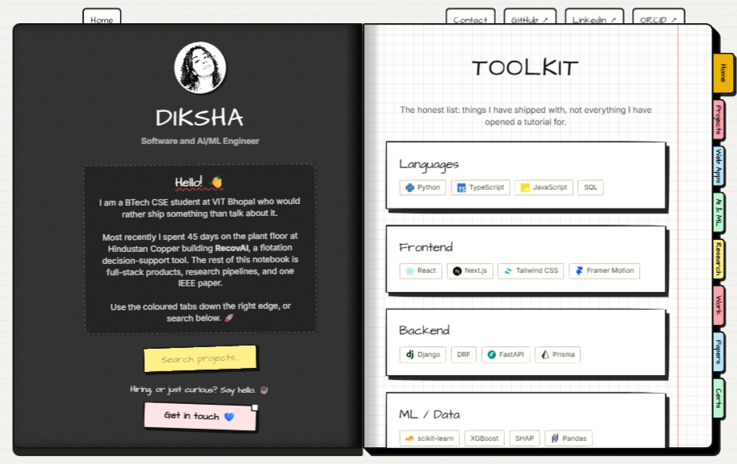

### Projects — cards split across the spread

Every card carries its stack, a **Live demo** link where one exists, the source, and a way into the full write-up.

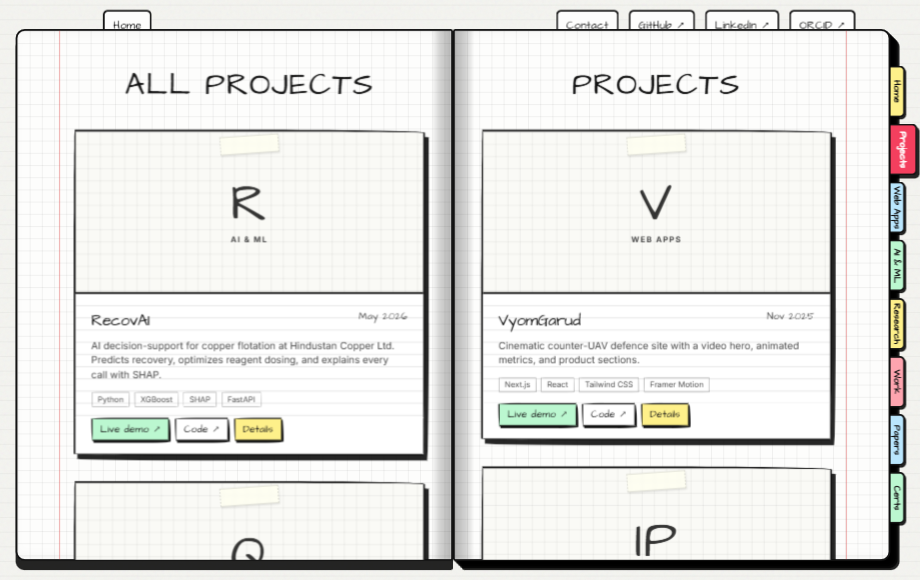

### A project page — the long version

Clicking a card turns the sheet over onto a dedicated spread: preview and headline result on the left, the story and the spec table on the right.

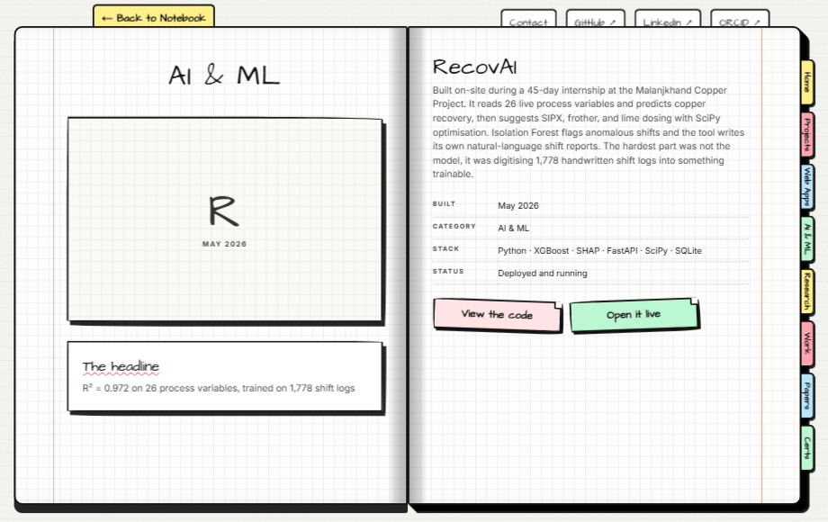

### Work, certificates and contact

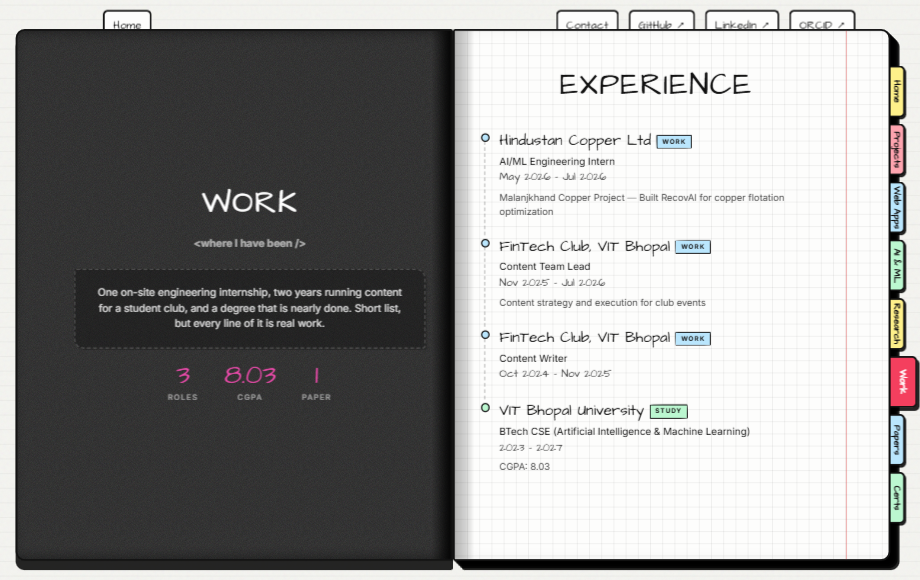

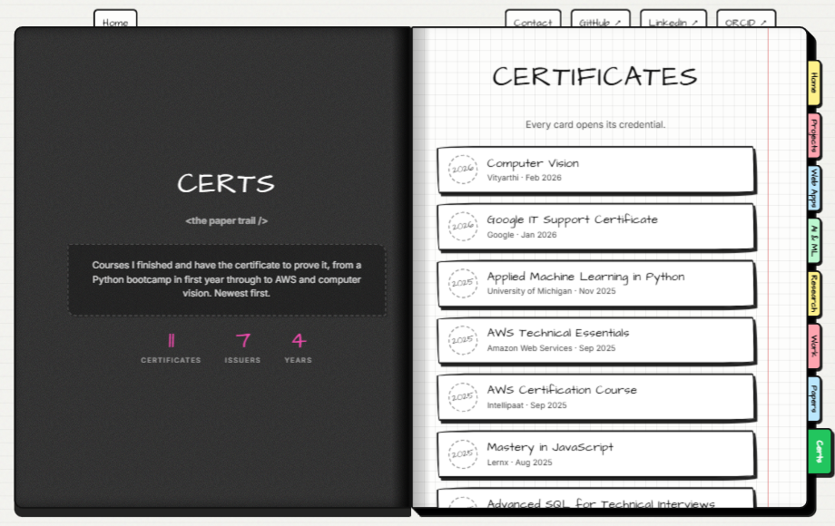

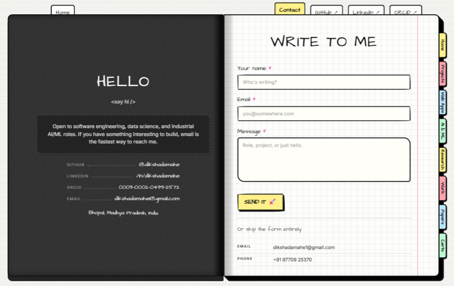

### On a phone

Below 900px the 3D is switched off entirely and the book flattens into a scrolling card feed, with a marquee explaining that the full spread lives on desktop.

<div align="center">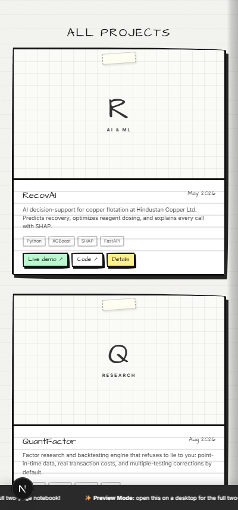</div>

---

## How it works

### Composition

The book is not a scroll container. Both pages are absolutely positioned halves inside one `preserve-3d` element, with a third sheet that only exists while a page is turning.

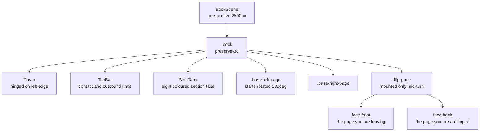

### Opening the cover

Three tweens run together for 1.5s on `power3.inOut`: the cover swings away, the left page swings in behind it, and the whole book slides from its closed offset to centred.

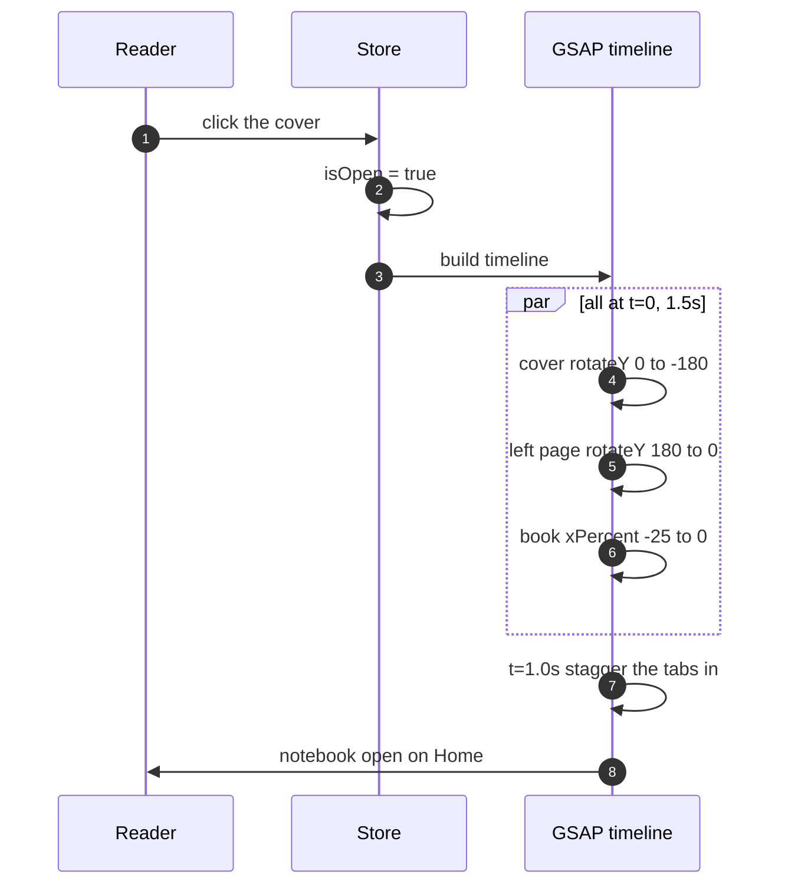

### Turning a page

The trick is that the destination is already painted underneath before the sheet starts moving, so the turn reveals rather than replaces.

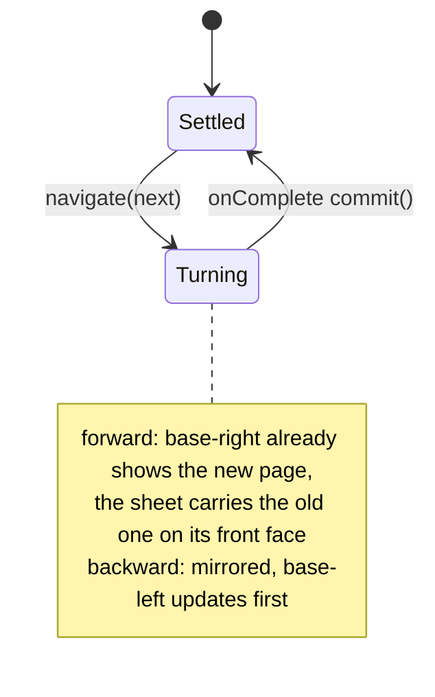

`resolveSpread(view, search)` is the single function that maps state to a `{ left, right, isLeftCover }` spread, so the base pages and the travelling sheet always render from the same source of truth.

### Navigating

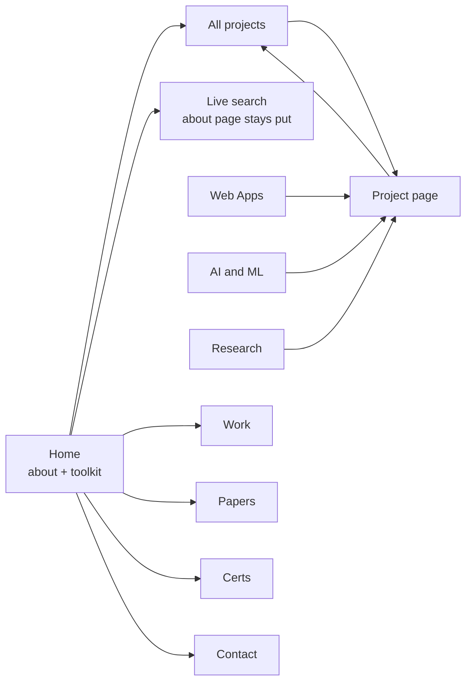

Searching never turns a sheet. The about page — and therefore the input — stays mounted on the left while results appear opposite, which is what keeps you from losing focus after the first keystroke.

---

## Project structure

```
app/
├── components/
│   ├── BookScene.tsx      orchestrates the cover flip and page turns
│   ├── Cover.tsx          the board cover and its table of contents
│   ├── TopBar.tsx         contact plus outbound links
│   ├── SideTabs.tsx       the eight coloured section tabs
│   ├── views.tsx          maps a View to a left/right spread
│   ├── AboutPage.tsx      inside-cover bio and project search
│   ├── ProjectCard.tsx    card with live demo, code and details
│   ├── ProjectDetail.tsx  the two halves of a project spread
│   ├── WrittenPages.tsx   work, papers, toolkit, certificates, contact
│   └── MobileBanner.tsx   the preview-mode marquee
├── constants/             all content lives here
│   ├── projects.ts        the ten projects
│   ├── work.ts            roles and education
│   ├── publications.ts    the IEEE paper
│   ├── certifications.ts  eleven certificates and credential URLs
│   ├── profile.ts         name, tagline, skills, socials
│   ├── categories.ts      project categories
│   ├── nav.ts             side tabs and top links
│   └── skillIcons.ts      Simple Icons slugs for the toolkit
├── stores/useNotebookStore.ts
├── types/index.ts
└── globals.css            the entire notebook: paper, spine, tabs, cards
```

## Editing the content

Nothing about the layout needs touching to keep this current.

| To change | Edit |
|---|---|
| Add or edit a project | `app/constants/projects.ts` |
| A job or degree | `app/constants/work.ts` |
| A certificate and its credential link | `app/constants/certifications.ts` |
| Name, tagline, skills, social links | `app/constants/profile.ts` |
| Which tabs appear and in what order | `app/constants/nav.ts` |

Counts shown on the cover and the stat rows are derived from these files, so they stay honest on their own.

Project cards fall back to a monogram until a screenshot exists. Drop an image in `public/screenshots/` and set `screenshot` on the project to use it.

## Running it

```bash
npm install
npm run dev     # http://localhost:3000
npm run build   # static export to out/
```

## Deployment

Pushing to `main` triggers [`deploy.yml`](.github/workflows/deploy.yml), which runs `next build` and publishes the static export to GitHub Pages. Pages must be set to **Source: GitHub Actions** rather than a branch.

## Stack

Next.js 16 (App Router, `output: 'export'`) · React 19 · TypeScript · GSAP for the 3D page mechanics · Zustand for view state · Tailwind CSS 4 alongside the hand-written notebook CSS · Architects Daughter and Inter via `next/font`.

There is no runtime backend. The contact form composes a `mailto:` so a static export can still send you a message.

## Credits

The notebook design is a faithful port of [ITom UI — Sketchbook Vol. 1](https://github.com/ITomPoland/ui-components) by [ITomPoland](https://github.com/ITomPoland), used with thanks under its MIT licence. Their sketchbook catalogues UI components; this one catalogues a portfolio. Toolkit marks come from [Simple Icons](https://simpleicons.org).
